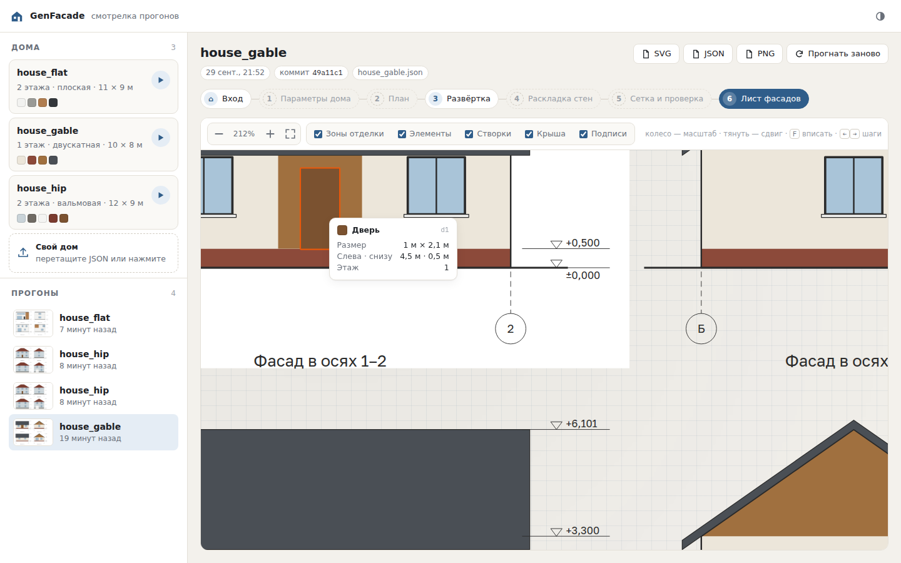

# GenFacade

Генерация векторных чертежей фасадов зданий по векторному плану и текстовому описанию.

Выпускная квалификационная работа, Университет ИТМО.
Тема: «Разработка метода генерации векторных чертежей фасадов зданий».

```
вход:   текстовое описание + векторный план дома (GenPlan — коттеджи; коллеги — МКД)
выход:  все фасады дома — цветной векторный чертёж (SVG + JSON)
режимы: 1 · глухой куб (окна ставит модель) · 2 · окна из плана (модель достраивает)
```

Схема модуля — [docs/assets/facade-modules.png](docs/assets/facade-modules.png),
требования — [specs/](specs/README.md).

В отличие от растровой генерации, результат должен оставаться **чертежом**:
сохранять геометрическую структуру, повторяемость элементов и выравнивание,
и допускать последующее редактирование в векторном редакторе или CAD.

## Установка

```
python3 -m venv .venv
.venv/bin/pip install -e ".[dev]"      # код, тесты, линтер
.venv/bin/pip install -e ".[dev,train]" # + torch, для обучения
.venv/bin/pytest && .venv/bin/ruff check .
npx -y jscpd@5.3.3 -c .jscpd.json genfacade tests tools   # копипаста, нужен Node

.venv/bin/genfacade run tests/fixtures/simple_house.svg \
    -t "A simple one-storey house" -m with_openings   # план + описание → фасады
.venv/bin/genfacade -c мои/ run tests/fixtures/simple_house.svg -t "…"  # со своими настройками
.venv/bin/genfacade serve                                            # смотрелка: http://127.0.0.1:8000
```

**Смотрелка** — на главной запуск «план + описание» (план из списка или свой SVG
GenPlan, режим) и история прогонов; прогон открывается на весь экран:
шаги 1–6 конвейера, чертёж (масштаб, слои — запретные зоны и нарушения на шагах 4–5,
карточка элемента при наведении), вход прогона с перезапуском. Esc или «назад» в браузере — на главную. Каждый прогон — папка
с трассой шагов в `outputs/runs/`.



Настройки по умолчанию — [genfacade/config/](genfacade/config/): библиотека материалов,
размеры и стиль листа. Своя папка с любыми из этих файлов переопределяет их.

## Статус

**Этап 1 закрыт 01.10.2026** ([план разработки](docs/dev-plan.md)):
сквозной конвейер — `genfacade run план.svg -t описание` проходит шаги 1–6
в обоих режимах — пока на одном простом доме 10 × 5 м с плоской крышей (gf#58): параметры
дома, препроцессор плана GenPlan, развёртка, раскладка стен, привязка к сетке и валидатор,
лист фасадов. Моделей пока нет: на шагах 1 и 4 — стабы с их интерфейсом
(`genfacade/models/`): фиксированный дом и заготовленные фасады.

Что уже сделано:

- этап 1: `genfacade run` — план GenPlan + описание по-английски → фасады всех сторон
  с трассой шагов 1–6; валидатор ловит окно плана, в которое упирается внутренняя стена
  (дефект GenPlan)
- этап 0: лист фасадов 1:100 в осях с отметками
  уровней (SVG + JSON + PNG), `genfacade serve` — смотрелка прогонов; настройки —
  в `genfacade/config/`
- постановка согласована с научруками и сведена в спеки; семь шагов конвейера,
  два режима, состав фасада по уровням (зоны отделки, палитра); схему и состав
  данных научруки одобрили 29.09
- разобраны код GenPlan (формат плана, генерация) и Facades-3D
- найдены данные: основной источник — 3D-модели BuildingNet v1 (~700–900 домов
  с планом и всеми фасадами), плюс синтетика building_tools и ручная разметка
  реальных чертежей для теста
- разобран CMP Facade (51 769 прямоугольников, регулярность измерена);
  найден вырожденный оптимум единственной опубликованной метрики регулярности

## Документация

| Документ | Содержание |
|---|---|
| [specs/](specs/README.md) | **Требования: постановка, вход, представление, метод, данные, оценка** |
| [docs/plan.md](docs/plan.md) | План работы для научруков — снимок 28.09 |
| [docs/statement.md](docs/statement.md) | Постановка до 28.09 — история; актуальное в specs/ |
| [docs/datasets.md](docs/datasets.md) | Датасеты фасадов, разбор формата CMP |
| [docs/methods.md](docs/methods.md) | Подходы к генерации и векторизации |
| [docs/lab-repos.md](docs/lab-repos.md) | Что уже есть в CTLab-ITMO |
| [docs/papers.md](docs/papers.md) | Литература |
| [docs/metrics.md](docs/metrics.md) | Метрики и проверки корректности |
| [docs/decisions.md](docs/decisions.md) | Журнал решений |

Правила работы над проектом — [CLAUDE.md](CLAUDE.md).
Исходная постановка от руководителя — [docs/incoming/](docs/incoming/README.md).
Порядок работы с требованиями — [docs/SPEC-DRIVEN.md](docs/SPEC-DRIVEN.md).

## Связанные проекты лаборатории

- [GenPlan](https://github.com/CTLab-ITMO/GenPlan) — генерация векторных планов частных домов и 3D
- [Facades-3D](https://github.com/CTLab-ITMO/Facades-3D) — генерация 3D-зданий с экстерьером
- [VGLib](https://github.com/CTLab-ITMO/VGLib) — методы векторной графики, в том числе EvoVec
- [Text2SVG](https://github.com/CTLab-ITMO/Text2SVG) — генерация SVG по тексту

## Структура

Как устроен код и в каком порядке пишется — [docs/dev-plan.md](docs/dev-plan.md).

```
genfacade/ пакет фасадного модуля
specs/     требования — единственный источник
docs/      база знаний, входящие, задачи, журнал
tools/     вспомогательный код (бэклог, проверка спек, парсеры датасетов)
tests/     тесты: unit/ по модулям, acceptance/ по критериям спек
materials/ чужие документы (вне git, опись в README)
data/      датасеты, не версионируется
```
