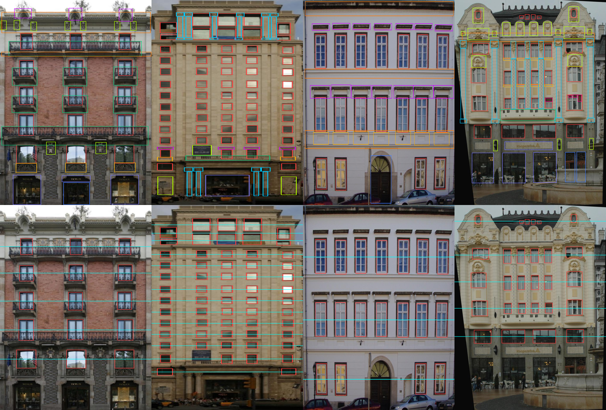

# Датасеты фасадов

Обновлено: 2026-09-25

## Главный вывод

> ⚠ **28.09.2026: у лаборатории есть собственный датасет** — растры, полученные
> из векторных фасадов, «про дома» (со слов Валерии). Это и есть «имеющийся
> размеченный набор» из ТЗ. Подробности неизвестны, запрошены — gf#1.
> Всё ниже относится к **публичным** данным.

Публичного датасета векторных **чертежей** фасадов не существует. Но CMP Facade
оказался гораздо ближе к вектору, чем мы думали: его разметка — это
**51 769 axis-aligned прямоугольников с классами в нормализованных координатах**,
то есть по сути уже готовое структурное представление фасада.

Это снимает главный блокер: путь «генерация напрямую в векторе» технически
реализуем без ручной разметки. Подробности ниже.

---

## CMP Facade Database — разобран

https://cmp.felk.cvut.cz/~tylecr1/facade/ · лицензия CC `[проверено: страница]`

Скачан и разобран целиком 2026-09-25. Всё в этом разделе — `[проверено: свой анализ]`,
если не указано иное. Парсер с учётом всех граблей: [../tools/cmp.py](../tools/cmp.py).

### Состав

- **606 изображений**: 378 `base` + 228 `extended`
- на каждое — три файла: `cmp_b0001.jpg` (фото), `.png` (маска классов), `.xml` (прямоугольники)
- разрешение: base W 241..1024 (медиана 779), H 207..1024 (медиана 828); extended аналогично

### Формат разметки

```xml
<object>
  <points><x>0.16211</x><x>0.24316</x><y>0.13636</y><y>0.21554</y></points>
  <label>3</label><labelname>window</labelname><flag>1</flag>
</object>
```

- **Все объекты без исключения — ровно 2 координаты x и 2 координаты y** (51769/51769),
  то есть axis-aligned прямоугольники. Ни полигонов, ни кривых.
- Координаты нормализованы в [0, 1].
- `flag` всегда равен 1 во всём датасете → информации не несёт, игнорируем.
- В XML встречается 11 имён классов. Класс `background` (label 1) в XML не появляется
  никогда — он есть только в масках PNG.
- `facade` встречается 689 раз на 606 изображений → на части кадров размечено
  более одной плоскости фасада.

### ⚠ Грабли 1: оси перепутаны относительно интуиции

**`<x>` — это вертикальная ось (строка, масштаб по высоте H), `<y>` — горизонтальная
(столбец, масштаб по ширине W).** Соглашение (row, col) как в MATLAB. На странице
датасета это нигде не написано.

Проверено сверкой с масками PNG на классах, встречающихся в кадре ровно один раз
(166 объектов): при таком прочтении медианный IoU = **0.978**, доля IoU > 0.9 — 96.4%;
при интуитивном прочтении медианный IoU = **0.000**.

Ошибка здесь не падает с исключением — она молча транспонирует весь датасет.

### ⚠ Грабли 2: формат XML неоднороден

В части файлов объект записан в одну строку, в части значения обёрнуты переводами
строк (`<label>\n2\n</label>`). Наивная регулярка `<label>(\d+)</label>` падает на
половине датасета. Парсер должен быть терпим к пробелам.

### Классы и их частота

| класс | объектов | доля |
|---|---:|---:|
| window | 20045 | 38.7% |
| pillar | 7168 | 13.8% |
| sill | 5259 | 10.2% |
| blind | 4425 | 8.5% |
| deco | 4070 | 7.9% |
| cornice | 4062 | 7.8% |
| balcony | 1872 | 3.6% |
| molding | 1788 | 3.5% |
| shop | 1769 | 3.4% |
| facade | 689 | 1.3% |
| door | 622 | 1.2% |

Объектов на изображение: min 5, медиана 77, среднее 85.4, max 368.

### Насколько фасады регулярны

Ключевой вопрос для гипотезы о структурно-осведомлённом методе ([methods.md](methods.md)).
Считалось по окнам: кластеризация центров по вертикали даёт этажи, по горизонтали — оси.
Все величины — в долях размера окна.

- окон на изображение: медиана 28 (max 311)
- структура: медиана **5 этажей × 8 осей**
- **ошибка выравнивания окон внутри этажа: медиана 0.046**, 75-й перцентиль 0.086
- **CV шага между этажами: медиана 0.085**
- разброс высоты окон в кадре: медиана 0.172; ширины: 0.227

**81.2% фасадов имеют окна, выровненные по этажам точнее 10% высоты окна.**
То есть структурный приор очень сильный — регулярность есть, и она измерима.

Важный нюанс: регулярны **положения**, но не размеры. Постоянную высоту окон
(разброс < 15%) имеют лишь 41.3% фасадов. Причины: разные типы окон на разных этажах
(витрины первого этажа, мансарда), неидеальная ректификация, шум разметки.
Значит структурные ограничения нужно формулировать через выравнивание и шаг,
а не через «все элементы одинаковые».

### Иерархия и вложенность

Пары классов, перекрывающиеся более чем на 50% меньшего (по первым 200 файлам):
`blind`+`window` 777, `deco`+`molding` 746, `molding`+`pillar` 549, `molding`+`sill` 307,
`balcony`+`window` 192. То есть вложенность в данных есть и она осмысленная —
представление фасада логично делать иерархическим.

### Ограничения

- **606 изображений — мало** для обучения генеративной модели с нуля.
  Но 51 769 размеченных прямоугольников — это уже прилично, если единицей обучения
  считать объект или фасад-как-последовательность.
- «Rectified» не значит «идеально фронтально»: часть кадров заметно скошена
  (видно на проверочной картинке ниже, правый столбец).
- Только прямоугольники — арки, скаты крыш и криволинейные элементы
  аппроксимированы bbox'ами.
- Нет текстового описания фасадов, а по контракту задачи вход — описание.
  **Описания придётся генерировать самим** из разметки (число этажей, типы элементов).
  Это отдельная подзадача, которой нет в ТЗ.

### Проверочная визуализация



Верхний ряд — вся разметка поверх фото. Нижний — только окна плюс автоматически
найденные линии этажей (голубым). Рамки ложатся на реальные элементы, этажи
детектируются корректно.

---

## High resolution building facade dataset for facade elements parsing

`10.1016/j.dib.2025.111950` · https://pmc.ncbi.nlm.nih.gov/articles/PMC12361793/

Разметка — пиксельные маски `[из абстракта]`. Объём и классы не выяснены.
Не скачан.

## City-Facade

https://github.com/gorgeouseping/City-Facade ·
https://www.sciencedirect.com/science/article/pii/S0924271626000031

**Облака точек**, не изображения `[из абстракта]`. 803 сегмента фасадов, ~200 млн точек,
5.5 ГБ, формат `.txt` с колонками x, y, z, intensity, instance, semantic;
классы 0..8; сплит 645 train / 158 test.

**Для нашей задачи практически бесполезен** — генерация 2D-вектора из LiDAR это
отдельная большая задача. В ТЗ попал, судя по всему, по названию.

---

## Другие датасеты фасадов — проверены

Проверено 2026-09-25. Разбор делал агент, ключевое перепроверено лично.

### Главный вывод

**Ни у одного из семи датасетов нет нативной геометрической разметки уровня CMP.**
У всех, у кого разметка вообще есть, это пиксельные маски. Единственное исключение —
**eTRIMS**, где рядом с семантическими масками лежат **инстансные**, и из них
bbox получается честно, без эвристик.

То есть «просто присоединить к CMP» не выйдет ни с кем. Реалистичный путь —
конвертация масок в геометрию, и качество этой конвертации у всех разное.

**Это само по себе аргумент для обзора:** доступная сегодня структурная разметка
фасадов практически исчерпывается CMP.

| Датасет | Жив | Изобр. | Разметка | Лицензия | Проверено |
|---|---|---|---|---|---|
| **eTRIMS** | да | 60 | **маски + инстансные маски** | research-only | лично |
| ECP / Teboul | сайт мёртв | 104 | маски (разметка есть, **изображений нет**) | не указана | частично |
| Graz50 | да | 50 | маски RGB | не указана | агентом |
| Paris Art Deco | да | 79 | маски (ASCII-матрица в .txt) | **не указана** | агентом |
| RueMonge2014 / VarCity | переехал | ~200+ | маски + грани 3D-меша | по заявке | нет |
| ZuBuD | переехал | 1005 | **разметки элементов нет** | не указана | нет |
| MPI Facade Segmentation | — | — | **это не датасет**, страница метода | — | нет |

### eTRIMS — единственный с геометрией `[проверено: свой анализ]`

http://www.ipb.uni-bonn.de/projects/etrims_db/downloads/etrims-db_v1.zip (78 МБ, живая)

Структура: `images/`, `annotations/` (индекс класса), **`annotations-object/`
(индекс экземпляра)**. Проверил лично: в одном кадре 11 инстансов против 5 классов,
то есть это действительно разные объекты, а не перекрашенные классы.
Всего по 120 файлам разметки (60 изображений × 2 варианта) — **2234 объекта**.

Классы: building, car, door, pavement, road, sky, vegetation, window.
На CMP ложатся `window`, `door`, `building`→`facade`; остальное выбрасывается.

Минусы: всего 60 изображений; **изображения не ректифицированы**, в отличие от CMP;
лицензия research-only, для статьи надо проверить совместимость.

### ECP — разметка есть, изображений нет

Сайт `vision.mas.ecp.fr` мёртв. Обновлённая разметка Martinović качается:
http://martinovi.ch/datasets/ECP_newAnnotations.zip (142 КБ, 104 PNG-маски).
**Сами изображения достать не удалось.** Классы почти полностью совпадают с CMP:
window, wall, balcony, door, roof, sky, shop, chimney.

Ректифицированные фасады, маски по построению прямоугольные — конвертация
в боксы дала бы хороший результат. Стоит написать авторам (Martinović, KU Leuven)
и попросить изображения.

### ⚠ У ECP была параметрическая разметка, и она утрачена

На архивной странице Teboul в таблице значится «Benchmark 2011 — 104 annotated
images — **62 Ko**». 62 килобайта на 104 изображения — это не маски, это компактное
структурное описание (разметка выводилась из грамматики). Ровно то, что нужно
нашей задаче.

Проверил лично: файлы `ground_truth_2011.zip` и `cvpr2010.zip` **в Wayback
не сохранились** — то, что скачивается по архивным ссылкам, оказывается
HTML-заглушкой Wayback, а не архивом. Зеркал не найдено.

### Остальные коротко

- **Graz50** — ⚠ **больше не качается**: 404 по всем путям, включая Wayback
  `[из отчёта агента, поправка от 2026-09-26]`. Раньше здесь было записано,
  что ссылка живая. 50 изображений, стилевое разнообразие. Но класс `wall` загрязнён:
  по признанию автора в readme, он «covers mostly all background which is not
  window or door, including sky and void». Полезны только window/door/balcony/shop.
- **Paris Art Deco** — 79 изображений, маски записаны ASCII-матрицей индексов
  в `.txt` размером с картинку. Стиль однородный, прироста разнообразия мало.
  Лицензии нет, просят цитировать Gadde et al., IJCV 2016.
- **RueMonge2014 / VarCity** — переехал на `varcity.ethz.ch/3dchallenge/`, помечен
  как «no longer maintained». Доступ только по заявке через Google Form.
  Заявку подать стоит сразу (ответ может идти долго), а планировать без него.
- **ZuBuD** — **не брать**. Это retrieval-датасет, разметки элементов фасада нет
  в принципе.
- **MPI Facade Segmentation** — не датасет, а страница метода. Полезна как список
  бенчмарков фасадного парсинга и как источник бейзлайн-метрик (per-image IoU
  по пяти датасетам, включая CMP) для сравнения в дипломе.

### LabelMeFacade — проверен, **как источник геометрии не берём**

https://github.com/cvjena/labelmefacade · 945 изображений · последний push 2016 ·
**LICENSE нет**, в README «non-commercial and research experiments»

Надежда была на то, что датасет собран из LabelMe с нативно полигональной
разметкой. Проверено: **полигонов в репозитории нет**, только растровые маски
и perl-скрипты, которыми маски делались.

Полигоны в принципе восстановимы — имя файла однозначно даёт путь к исходной
аннотации LabelMe (`folder__name.jpg` → `Annotations/folder/name.xml`). Но
сервер `labelme.csail.mit.edu` из нашего окружения недоступен, зеркало MIT отдаёт
500, а через Wayback восстанавливается лишь **207 из 945 изображений (22%)**.

**Главное — даже с полигонами датасет не подходит** `[проверено: свой анализ
99 скачанных XML]`:

- **Это уличные сцены, а не фасады.** Окна занимают 3.5% пикселей, здания сняты
  под углом, нижние ярусы перекрыты деревьями и машинами.
- **Изображения не ректифицированы.** Окна размечены перспективно искажёнными
  четырёхугольниками: 84% окон — quad, но медианное отклонение стороны от осей
  **8.5°**, в пределах 5° укладываются лишь 35% окон, у 21% отклонение больше 20°.
  Против CMP, где всё axis-aligned по построению.
- **Классы не покрывают CMP.** На 99 изображениях: window 1919, building 287,
  door 71, shutter 70, balcony 46 — и **cornice 1, pillar 3, shop 2, sill 0,
  molding 0, deco 0**. То есть ровно тех классов, которые делают разметку CMP
  чертежом, там нет. Остаётся детекция окон.
- **Словарь неконтролируемый** — 679 различных текстовых меток на 99 изображений
  («car occluded», «window occluded», «wheel rim»). Нормализация вручную стала бы
  отдельным источником ошибок и вопросов на защите.
- **Лицензии нет вообще**, права на исходные фото у авторов LabelMe. Выкладывать
  производный датасет нельзя без выяснения прав.

**Где всё же полезен:**

1. **Out-of-domain тест.** 945 готовых пиксельных масок «как есть», без всякого
   доставания полигонов — проверить, что пайплайн не разваливается
   на неректифицированных уличных фото.
2. **Аргумент в обзоре.** Ещё один крупный «фасадный» датасет, который на поверку
   даёт только растр, а исходные полигоны наполовину утрачены вместе с сервером.
   Та же картина, что и с семью проверенными датасетами.

### Порядок, в котором брать

1. **eTRIMS** — единственный с честной геометрией
2. **LabelMeFacade** — если подтвердятся исходные полигоны, сразу поднимается на первое место
3. **ECP** — если удастся достать изображения
4. **Graz50** — ради стилевого разнообразия
5. **Paris Art Deco** — однородный стиль, мало новизны
6. **RueMonge2014** — заявку подать, но не планировать
7. ~~ZuBuD~~ — не брать

## ⭐ Solar Decathlon — векторные чертежи фасадов коттеджей в public domain

`[проверено: свой анализ, 2026-09-26]` — **самая ценная находка разведки.**

Организаторы конкурса Solar Decathlon публиковали полные комплекты рабочей
документации команд. По Wayback CDX — **76 комплектов, ~2.64 ГБ**:
SD2011 (20), SD2013 (20), SD2015 (15), SD2017 (12), SD2020 (9), плюс
Solar Decathlon Europe 2010 (16).

Скачал и разобрал `missouri-st-drawings.pdf` (5.1 МБ, 99 листов):

- **Листы фасадов есть:** страницы 31–34 — `EXTERIOR ELEVATIONS`,
  на листе 31 заголовок `NORTH ELEVATION`.
- **Это вектор, а не скан:** на листе фасада **31 595 векторных объектов**
  (45 466 линейных примитивов, 149 прямоугольников, 76 кривых), 209 слов
  настоящего текста. Producer — `Acrobat Distiller`, то есть печать из CAD.
- **Лицензия:** штамп `PUBLIC DOMAIN` на **97 листах из 99** — но это в данном
  комплекте. По всей выборке штамп стоит лишь у 30 векторных комплектов из 44,
  у остальных права под вопросом.

> ⚠ **Исправление после зеркалирования (2026-09-26).** Оценка «300–500 листов»
> была завышена впятеро — она строилась по индексным страницам одного комплекта.
> Реально скачано 64 комплекта, из них **44 векторных**, и в них **113 листов
> наружных фасадов**. Со штампом PUBLIC DOMAIN — только **30 комплектов
> и 69 листов**. Это на порядок меньше 606 изображений CMP.
> Подробности и разбивка — в [tasks/gf-0026.md](tasks/gf-0026.md).

**Оговорки, без которых картина неверна:**

1. **Источник умирает.** `solardecathlon.gov` переименован, старые пути отдают
   мягкий 404 (HTTP 200 с HTML главной). Живо только через Wayback, последние
   снапшоты — декабрь 2024, сам Internet Archive периодически недоступен.
   **Если берём — зеркалировать надо не откладывая.**
2. **Семантики нет.** Слоёв в PDF не осталось, прямоугольник — просто
   прямоугольник, а не «окно». Разметку делать самим. Есть текстовые выноски
   («CEDAR SHAKE SIDING», «HAND RAIL») как слабый сигнал.
3. **Смещение выборки.** Это экспериментальные солнечные дома студенческих
   команд: одноэтажные, ~90 м², много панелей и затеняющих экранов.
   Частные дома — да, типовой коттедж — нет.
4. Нативных DWG/DXF/IFC в архиве нет, только PDF. Европейские комплекты 2010 —
   сканы, не вектор.

Именно отсюда брала данные статья из описания темы (Wan et al., Sustainability
2023): 93 отобранных проекта, вручную раскрашенных в Photoshop, датасет
не выложен («available on request»). **Мы можем взять источник целиком,
а не 93 картинки.**

## SYNBUILD-3D — синтетика с векторными проёмами

https://arxiv.org/abs/2508.21169 · https://github.com/kdmayer/SYNBUILD-3D ·
Stanford · **CC BY 4.0** `[из отчёта агента]`

Окна и двери как **3D-точки плюс матрицы смежности** — настоящий вектор.

> ⚠ Заявленные «6.2 млн зданий» в ВКР писать нельзя: это комбинаторика
> перестановок планов по этажам. Уникальных **экстерьеров — 8 698**, и фасад
> зависит только от экстерьера. Это всё равно в 14 раз больше CMP.

## Прочее по малоэтажке `[из отчёта агента, не перепроверял]`

- **SydneyHouse / HouseCraft** (ECCV 2016) — 522 изображения, 174 одноэтажных
  отдельно стоящих дома Сиднея, маски плюс параметрические высоты проёмов.
  **Лицензии нет**, производное от Street View.
- **Sezen / Atik** (ITU, ISPRS 2022) — 1000 фото, дословно «detached houses,
  apartments, and residences», Турция, **bbox** окон и дверей. Лицензии нет.
- **BuildingNet** — 2000 3D-моделей, 31 класс, включая **Chimney, Dormer,
  Shutters** — редкий случай, где есть классы именно коттеджа.
- **3DBAG** (CC BY 4.0) — 10 млн зданий Нидерландов, LoD2.2: силуэт и форма
  кровли есть, **проёмов нет**.
- **Пул IFC-моделей** даёт точный ground truth по построению, но всего
  десятки домов: KIT / IFC Wiki (5, «unrestricted use»), bim-whale (6, MIT),
  buildingSMART Community (171, CC BY 4.0), GNI BIM (224, но 208 — один объект).
- Русский сегмент: `catalog-plans.ru` (5957 проектов) и `alfaplan.ru` (3742) —
  настоящие ортогональные фасады ИЖС, но растр с вотермарком и прямой запрет
  на копирование. Правовая развилка, решать хозяину.

> **Для обзора, проверено агентом:** FaçAID (SIGGRAPH Asia 2024) в тексте статьи
> обещает выложить данные и процедурный генератор на сайте проекта —
> **релиз не состоялся**, на `facaid.github.io` блок с ссылкой на датасет
> остался закомментированным.

## Найдено при разведке по коттеджам (2026-09-26)

Всё `[из отчёта агента]`, если не указано иное. Ни один не скачан.

### LSAA — потенциально снимает главный блокер

https://github.com/ZPdesu/lsaa-dataset · KAUST, TVCG 2020 · ★43,
обновлён 2026-09-10 `[проверено: GitHub API]`, **лицензии в репозитории нет**
(в README заявлена CC BY-NC-SA 4.0 на аннотации).

**199 723 фасада** из панорам Google Street View, разметка — **bbox окон, дверей,
балконов** плюс атрибуты. Это в 330 раз больше CMP и **ровно наш формат**:
классифицированные прямоугольники.

Pro-DG дообучал ControlNet именно на LSAA (23k изображений) — то есть датасет
практически пригоден.

> Что проверить, прежде чем радоваться: выкачиваются ли ещё панорамы (датасет 2020 года,
> Google их удаляет); есть ли фильтр по этажности, чтобы вытащить малоэтажку;
> изображения принадлежат Google — для обучения в рамках ВКР приемлемо,
> для публикации производного датасета нет.

### WorcesterMA Housing Facades — единственный массив коттеджей

HuggingFace `murai-lab/WorcesterMA_Housing_Facades` · **лицензия MIT**,
изменён 2025-12-30 `[проверено: HF API]`

**22 949 уличных фотографий американских малоэтажных жилых домов**, 14 ГБ,
4 класса фасада и год постройки. **Структурной разметки элементов нет** — только
классификация. Псевдоразметку можно получить готовым CMP-сегментером.

### HZNU Facade — лучшая лицензия

data.mendeley.com/datasets/k387xkyc5f/1 · **CC BY 4.0** · 624 фасада 4056×3856,
JSON-разметка плюс **матрицы гомографии для ректификации**. Ханчжоу, жильё
и коммерция.

### Прочее

- **FloorPlanCAD** — 15 663 CAD-чертежа **в SVG**, CC BY-NC 4.0. Планы, не фасады,
  но методический ориентир «ML поверх SVG-примитивов».
- **TUM-Facade** (CC0, 33 фасада) и **ZAHA** (66 фасадов) — облака точек, не наш формат.
- **HuggingFace: ничего структурного.** Все датасеты с фасадами — перезаливки CMP.
  Ни одной модели «текст → структура фасада».

## Сводная пригодность

| Датасет | Тип | Пригодность |
|---|---|---|
| **CMP Facade** | фото + **прямоугольники с классами** | **высокая, основной** |
| eTRIMS | фото + **инстансные маски** | средняя, геометрия восстановима честно |
| LabelMeFacade | маски; полигоны на 22%, перспективные | **не брать**, годится как out-of-domain тест |
| ECP | маски есть, изображений нет | под вопросом |
| Graz50, Paris Art Deco | маски | низкая, только ради разнообразия |
| High-res facade parsing | фото + маски | средняя, для растрового пути |
| RueMonge2014 | маски + 3D | по заявке |
| City-Facade, ZuBuD | облака точек / retrieval | не подходят |
